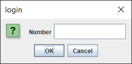

# Description
This application processes a csv file in the following format:  
```
id,sms_phone  
103343262,6478342944  
103426540,84528784843  
103352136,_DELETED_1488176172  
103266195,639156553262_DELETED_1486721886
```
and checks for correctness of the phone numbers.  
The output of the processing is printed in standard output and in three files (one for accepted numbers, one for incorrect numbers and one for corrected numbers), placed in the same directory where input file resides. Afterwards a form allows to check the correctness of a number chosen at will.

# Requirements
- Java (tested with Java 1.8)
- Gradle (tested with Gradle 7.0)

# Building
To build the application cd into the project directory (where build.gradle file resides) and run Gradle's jar task (if gradle script is not in the path, full path needs to be specified)  
`gradle jar`  
The output will go in the build/libs directory.

# Running
To run the application cd into the project directory and run the java command as follows:  
`java -jar build\libs\demo-main.jar <inputfile>`  
*inputfile* must be the path to the .csv files containing the list of numbers  
If no inputfile parameter is passed, usage is printed.  
After the inputfile has been processed, a form appears.  
  
Insert some text and press OK button to validate.  
Press Cancel button to exit the application.

# Testing
Application uses jUnit to run some tests.  
Cd into the project directory and run Gradle's test task to run them:  
`gradle test`

# Creating the Javadoc
To create the Javadoc cd into the project directory and run Gradle's javadoc task  
`gradle javadoc`  
The output will go in the build\docs\javadoc directory.
